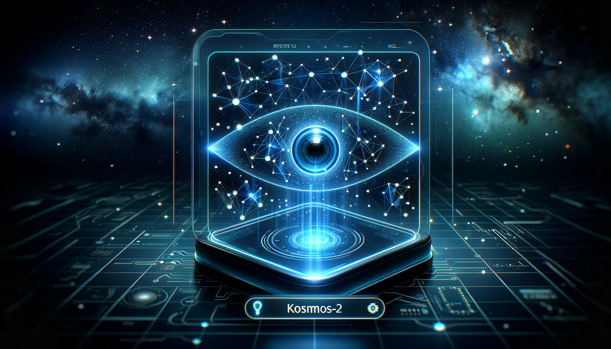

# Kosmos-2-Patch14-224 Interface

This repo is a simple object detection testing platform using Kosmos-2 from Microsoft



## Install

```bash
git clone
cd
pip install -r requirements.txt
chmod +x run.sh
```

```bash
./run.sh
```

## Citations

```bibtex
@article{kosmos-2,
  title={Kosmos-2: Grounding Multimodal Large Language Models to the World},
  author={Zhiliang Peng and Wenhui Wang and Li Dong and Yaru Hao and Shaohan Huang and Shuming Ma and Furu Wei},
  journal={ArXiv},
  year={2023},
  volume={abs/2306}
}

@article{kosmos-1,
  title={Language Is Not All You Need: Aligning Perception with Language Models},
  author={Shaohan Huang and Li Dong and Wenhui Wang and Yaru Hao and Saksham Singhal and Shuming Ma and Tengchao Lv and Lei Cui and Owais Khan Mohammed and Qiang Liu and Kriti Aggarwal and Zewen Chi and Johan Bjorck and Vishrav Chaudhary and Subhojit Som and Xia Song and Furu Wei},
  journal={ArXiv},
  year={2023},
  volume={abs/2302.14045}
}

@article{metalm,
  title={Language Models are General-Purpose Interfaces},
  author={Yaru Hao and Haoyu Song and Li Dong and Shaohan Huang and Zewen Chi and Wenhui Wang and Shuming Ma and Furu Wei},
  journal={ArXiv},
  year={2022},
  volume={abs/2206.06336}
}
```
